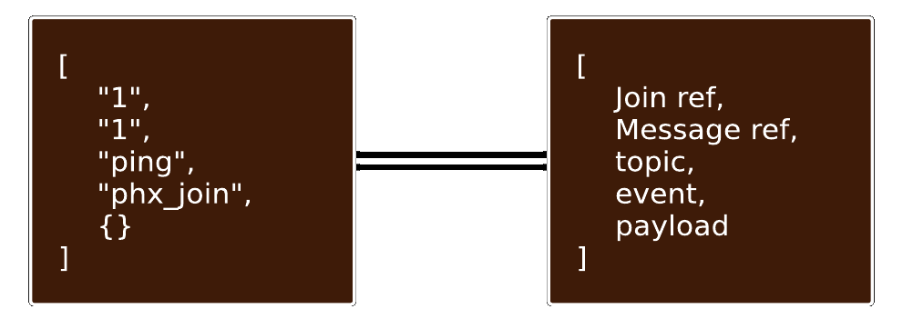

# HelloSockets

Basic Elixir - Phoenix WebSocket application for observing how a WebSocket connects and transmits data.

All of this info was taken from the book _Real-Time Phoenix_ by \*\*

### WebSocket Protocol

`https://tools.ietf.org/html/rfc6455`

###Establishing the Connection
Load the HelloSockets webpage by visiting http://localhost:4000. You will see the default generated Phoenix start screen. What we want to see is hiding from us, and we’ll use the DevTools in our browser to view it. You can open the DevTools by `right click > Inspect` on the webpage. There will be a variety of tabs, but we want to select the `Network` tab. Once there, reload the webpage in order to capture the connected WebSocket.

Select the `WS` tab in order to only show WebSocket connections. You are looking for the connection labeled `websocket?token=undefined&vsn=2.0.0`. You may see another connected WebSocket because Phoenix comes with a developer code reloader that operates over a WebSocket, but you can ignore that one.

A WebSocket connection follows this request flow:

1. Initiate a `GET` HTTP(S) connection request to the WebSocket endpoint
2. Receive a `101` or error from the server
3. Upgrade the protocol to WebSocket if `101` is received
4. Send/receive frames over the WebSocket connection

### How to intertact with this application

I implemented `PingChannel` and configured our `Socket` route to send the `ping` topic to our `Channel`. We can use a CLI application to test that our `Channel` works. `wscat` is an npm package that allows for connecting to, sending data to, and receiving data from a WebSocket. It can be a little cumbersome to use but has the advantage of being easy to setup. Use `npm install -g wscat` in order to get started.

####`ping` topic
| Step | Command | Output |
| ---- | -------------------------------------------------------------- | ------------------------------------------------------------------------- |
| 1 | `$ wscat -c 'ws://localhost:4000/socket/websocket?vsn=2.0.0' ` | _connected (press CTRL+C to quit)_ |
| 2 | `["1","1","ping","phx_join",{}]` | _["1","1","ping","phx_reply",{"response":{},"status":"ok"}]_ |
| 3 | `["1","2","ping","ping",{}]` | _["1","2","ping","phx_reply",{"response":{"ping":"pong"},"status":"ok"}]_ |

####`wild` topic
The rule for joining this topic is that the last number should double the first number. If not, you can't join.
| Step | Command | Output |
| ---- | -------------------------------------------------------------- | ------------------------------------------------------------------------- |
| 1 | `$ wscat -c 'ws://localhost:4000/socket/websocket?vsn=2.0.0' ` | _connected (press CTRL+C to quit)_ |
| 2 | `["1","1","wild:1:2","phx_join",{}]` | _["1","1","wild:1:2","phx_reply",{"response":{},"status":"ok"}]_ |
| 3 | `["1","2","wild:1:2","ping",{}]` | _["1","2","wild:1:2","phx_reply",{"response":{"ping":"pong"},"status":"ok"}]_ |
| 4 | `["1","3","wild:1:3","phx_join",{}]` | _["3","3","wild:1:3","phx_reply",{"response":{},"status":"error"}]_ |
| 5 | `["1","4","wild:20:40","phx_join",{}]` | _["4","4","wild:20:40","phx_reply",{"response":{},"status":"ok"}]_ |
| 6 | `["1","5","wild:2:4:6","phx_join",{}]` | _["5","5","wild:2:4:6","phx_reply",{"response":{},"status":"error"}]_ |

#### Phoenix Message Structure

### Installation

To start your Phoenix server:

- Install dependencies with `mix deps.get`
- Install Node.js dependencies with `npm install` inside the `assets` directory
- Start Phoenix endpoint with `mix phx.server`
